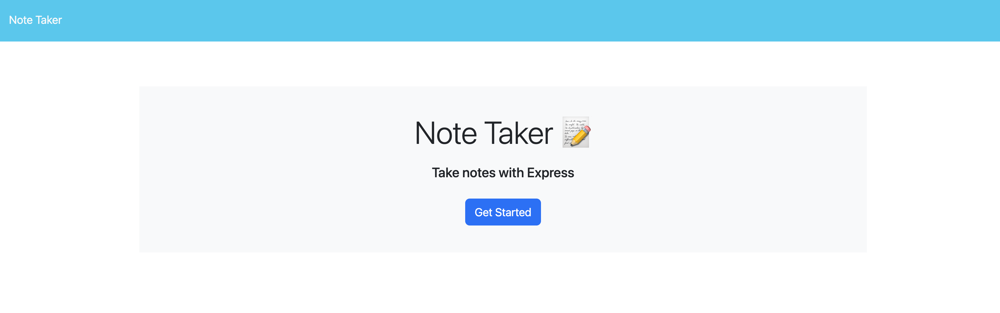
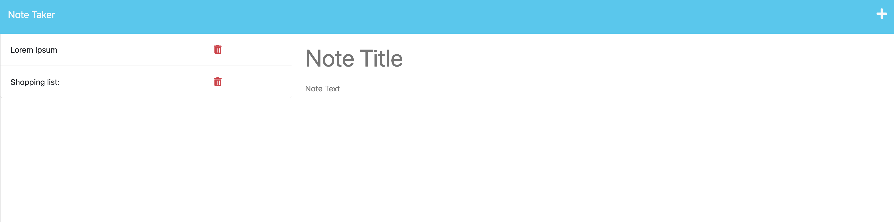

## Express Note Taker by Elibrer 


---


*This application can be used to take notes and save them to a server for access at any time, from anywhere.*

## Languages used
     

## Links
> - [GitHub Repository](https://github.com/elibrer/express-note-taker)
> 
> - [Deployed Application](https://express-note-taker-eli.herokuapp.com/)

## Contributors
> Elijah Brereton @[GitHub](https://github.com/elibrer)


## Table of Contents
- [Description](#description)
- [Installation](#installation)
- [Features](#features)
- [Documentation](#documentation)
- [Application Preview](#full-preview)
- [License](#license)
- [Tests](#tests)
- [Questions](#questions)

## Description
For when the user needs to take notes and be able to view from wherever they are. Being able to store data on a server allows for remote access, so that the user doesn't need to be using the same device to see the stored data.

## Installation
For usage of this application, visit the [Note Taker](https://express-note-taker-eli.herokuapp.com/) website via heroku. No further installation is required to access and operate the application. 

If the user wishes to pull and edit the applciation for themselves, ensure `node.js` has been installed on your system. For instructions on how to do this please visit: [nodejs.org](https://nodejs.org/en).

Further, the `express.js` package must also be installed. This can be done by opening console with the root folder set to the applciation folder `express-note-taker` and typing and entering:
```
npm i express
```

## Features
- Once the web page loads, the user is presented with a landing page featuring a title, description of the application, and a button.
- When the user presses the button, they are taken to the main page of the application which features all stored notes shown on the left side of the page, and input boxes on the right to fill out new notes to save.
- When an existing note title is pressed on the left side, the blank title and text area to the right is filled in with the existing notes title and data.
- When the + button is pressed in the top right corner, the title and text area is cleared (if previous data has been shown).
- When the user enters data into the fields, they may then press the save button in the top right corner, which will then save the note to the left side of the page to be accessed in the same way as described above.
*(Note, if nothing is entered into either the title or text area, the save button will not appear)*

- When the user presses the delete button next to an existing note, the relative note will be deleted from the list, and the data will be removed from the database.
-If the user wishes to see the data from the database in JSON format, they may use the route `/api/notes`.

## Documentation
No documentation provided.
## Application Preview

### `Note Taker Application Landing Page`


### `Note Taker Application`



## License
[Licensed under the MIT license.](https://opensource.org/licenses/MIT)

## Tests
To test, simply run the application by using the instructions provided above. If there are any errors, or the application did not work in the intended way, please try to locate and log the lines of code that bring up the error, and forward all issues to the email below.

## Questions
For questions and enquiries, please contact me at: 
[eli.brer@gmail.com](eli.brer@gmail.com)